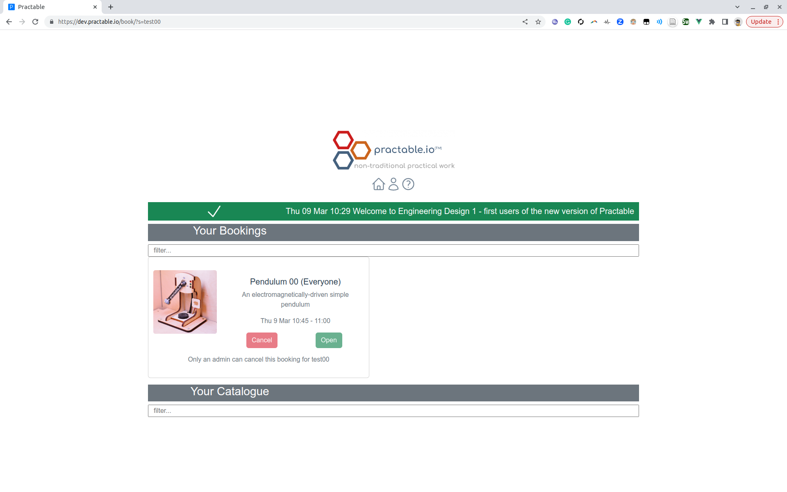
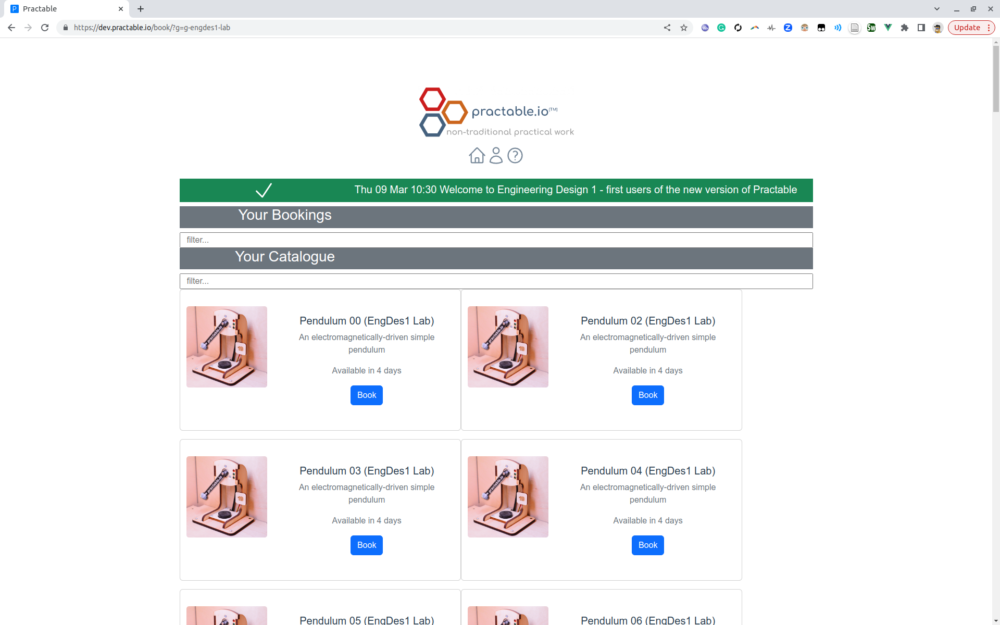
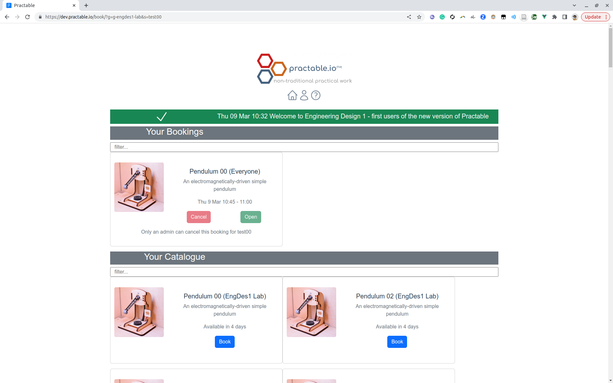
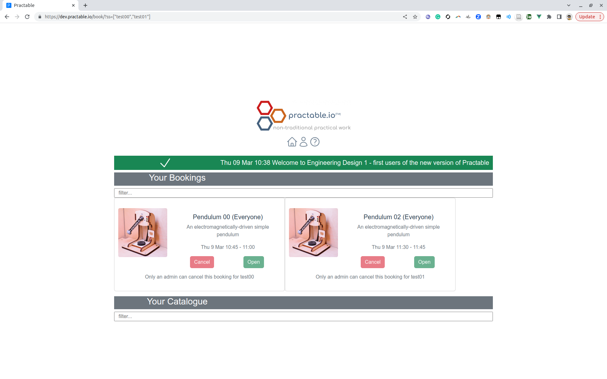
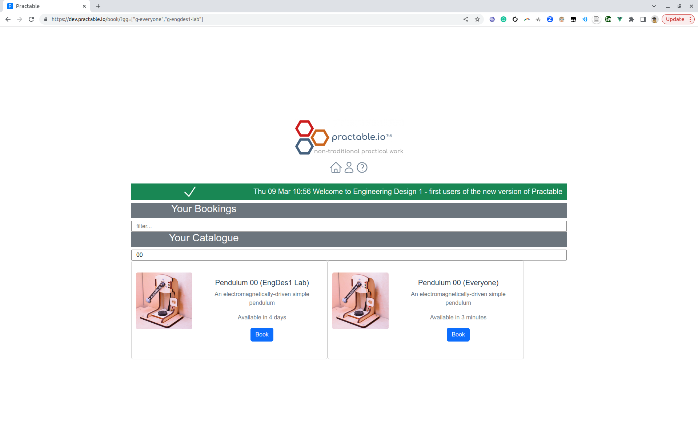

 

# bookjs

Javascript client for booking experiments from [practable/book](https://github.com/practable/book).

## Status

 

# bookjs

Javascript client for booking experiments from [practable/book](https://github.com/practable/book).

## Status

In production (with some ongoing development)

## About

### Home


### Booking


### Cancelling


)

## Usage

A unique anonymous `userName` is assigned to each user, and kept in local storage.

A user must belong to one or more groups to access equipment, OR be given a session with pre-booked times on one or more pieces of equipment.

Any groups and sessions can be added to a user account by using query parameters. Groups and sessions are persisted in local storage (in `sessionNames` and `groupNames`).


The following query parameters are available

| short | long | format | example | comment |
|-----|-----------|--------|---------|---------|
| g   | group     | string | `g-ed1` | for a single group only |
| gg  | groups    | JSON array | `["g-ed1","g-ep1"]`  | for more than one group |
| s   | session     | string | `s123` | for a single session only |
| ss  | sessions    | JSON array | `["s123","s456"]`  | for more than one session |
     
Note that arrays are not natively handled by the vue router particularly well, it seems, so do not use the approach of repeating the same url param. The quotes MUST be included so that the arrays are valid JSON, else they will not be parsed the groups/sessions not added.

### Session

When a user is given an url with a session in it, they only see bookings for that session, and not any other sessions they may currently have. This is to help users by only showing them what they need to see, e.g. `https://dev.practable.io/book/?s=test00`



If the user then enters a link with a different session, they no longer see the booking from the earlier session - only the one in the link, `https://dev.practable.io/book/?s=test01`


### Group

A user can be a member of multiple groups. If there is no group in the URL, then the default `g-everyone` group is assumed. However, if any other group is in the link, then the `g-everyone` group is not added (just to avoid making the list of experiments long and overloading users with choice). `https://dev.practable.io/book/?g=g-engdes1-lab`



### Session and Group

If you want a student to use a pre-booked session AND also later book something themselves, you can either give them
(a) two links, one for the lab, and one for later use, OR
(b) combine into a single link e.g. `https://dev.practable.io/book/?g=g-engdes1-lab&s=test00`



### Multiple Sessions

If you want to give a user a link that has more than one session, then use the plural form of the query parameter `ss`, and set it equal to a JSON formatted array e.g. `https://dev.practable.io/book/?ss=["test00","test01"]`

You can also use URL encoding for the quotes. The overall array string should NOT be in quotes.
```
https://dev.practable.io/book/?ss=[%22test00%22,%22test01%22]
```


### Multiple Groups

If you want to give a user a link that has more than one session, then use the plural form of the query parameter `ss`, and set it equal to a JSON formatted array e.g. `https://dev.practable.io/book/?gg=["g-everyone","g-engdes1-lab"]`

You can also use URL encoding for the quotes. The overall array string should NOT be in quotes.

`https://dev.practable.io/book/?gg=[%22g-everyone%22,%22g-engdes1-lab%22]`



### Multiple Sessions and Groups

You can combine single and plural forms of each query parameter in the same link, and the user will see all the sessions/groups listed, however this form is not recommended because it is less elegant than just putting all the elements in a single array i.e. if there is more than one session, just use `ss` and if there is more than one group, just use `gg`.

Do NOT use the query parameter array format where a query param is repeated (e.g. `some_bad_url/?c=thing0&c=thing1`). In testing this did not perform as expected.

You can have multiple sess

## Developer notes

to run locally

```
npm install
npm run dev
```

or to build for distribution

```
npm install
npm run build
```


