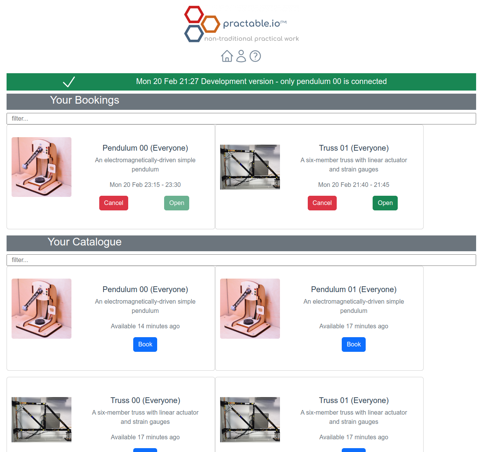
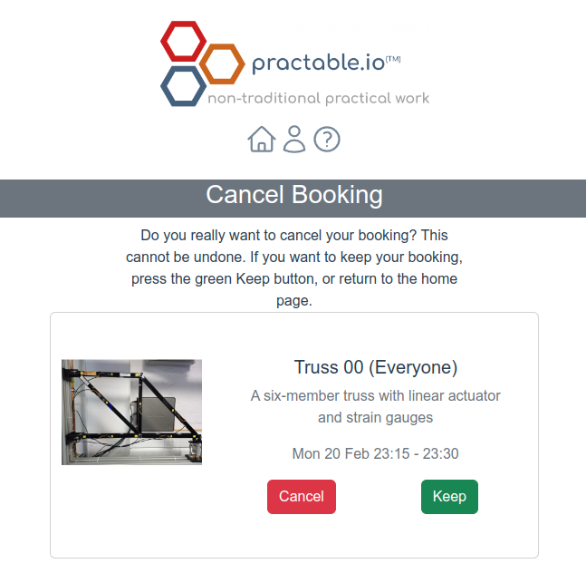

 

# bookjs

Javascript client for booking experiments from [practable/book](https://github.com/practable/book).

## Status

Pre-release for user testing

## About

### Home


### Booking


### Cancelling



## Usage

A unique anonymous userName is assigned to each user, and kept in local storage.

A user must belong to one or more groups to access equipment, OR be given a session with pre-booked times on one or more pieces of equipment.

Any groups and sessions can be added to a user account by using query parameters. Groups and sessions are persisted in local storage.


The following query parameters are available

| parameter | format | example | comment |
|-----------|--------|---------|---------|
| group     | string | `g-ed1` | for a single group only |
| groups    | JSON array | `["g-ed1","g-ep1"]`  | for more than one group |
| session     | string | `s123` | for a single session only |
| sessions    | JSON array | `["s123","s456"]`  | for more than one session |

Note that arrays are not natively handled by the vue router particularly well, it seems, so do not use the approach of repeating the same url param. The quotes MUST be included so that the arrays are valid JSON, else they will not be parsed the groups/sessions not added.

For example, a user could be given a link that both loads prebooked times in a session, and allows later access via a group

```
https://uoe.practable.io/book/?group=g-ed1&session=tue-21-feb-2023-engdes1-lab-1400-1600-pend-then-spin-xh6gfd
```


## Developer notes

to run locally

```
npm install
npm run dev
```

or to build for distribution

```
npm install
npm run build
```


